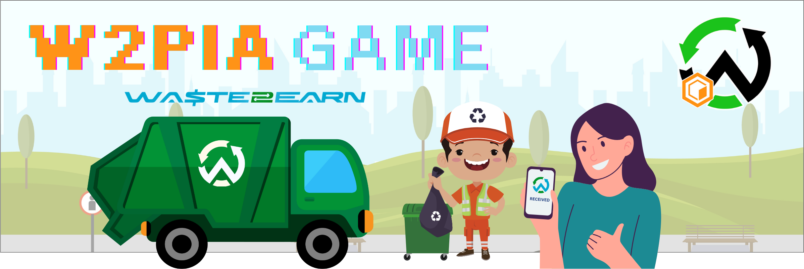

# W2pia - Garbage Sort&Collect Game 🗑️

Welcome to W2pia, an engaging game where you take on the role of a responsible citizen tasked with collecting falling garbage from the sky and sorting it into the right bins. Your goal is to promote environmental awareness and proper waste disposal! 🌍

## Game Overview 🎮

W2pia is a 2D game developed using the Pygame library in Python. It combines fast-paced action with educational elements to deliver an entertaining experience while highlighting the importance of recycling. 🚀

## How to Play 🕹️

### Main Menu

1. **Start Game:** Begin your garbage collection journey.
2. **Quit:** Exit the game.

### In-Game Controls

- Use the mouse to control the player character.
- Click on garbage items falling from the sky to collect them.
- Move the collected garbage to the correct bins for recycling.

### Recycling Bins ♻️

1. **Plastic Bin:** Collect plastic items.
2. **Metal Bin:** Collect metal items.
3. **Glass Bin:** Collect glass items.
4. **Paper Bin:** Collect paper items.
5. **Organic Bin:** Collect organic waste.

### Game Mechanics

- Avoid letting garbage items reach the ground without collecting them.
- Sort the garbage efficiently to earn points.
- The game gets progressively challenging as more garbage falls.

## Installation 🚀

To play Trashformers, follow these steps:

1. Install Python: [Python Download](https://www.python.org/downloads/)
2. Install Pygame: Open a terminal and run `pip install pygame`
3. Download the game files from [GitHub Repository Link]().
4. Run the game script: `python trashformers.py`

## Credits 🙌

- Game Development:
- Artwork and Graphics:
- Background Music:
  

Enjoy playing W2pia and have fun saving the planet, one piece of garbage at a time! 🌟
